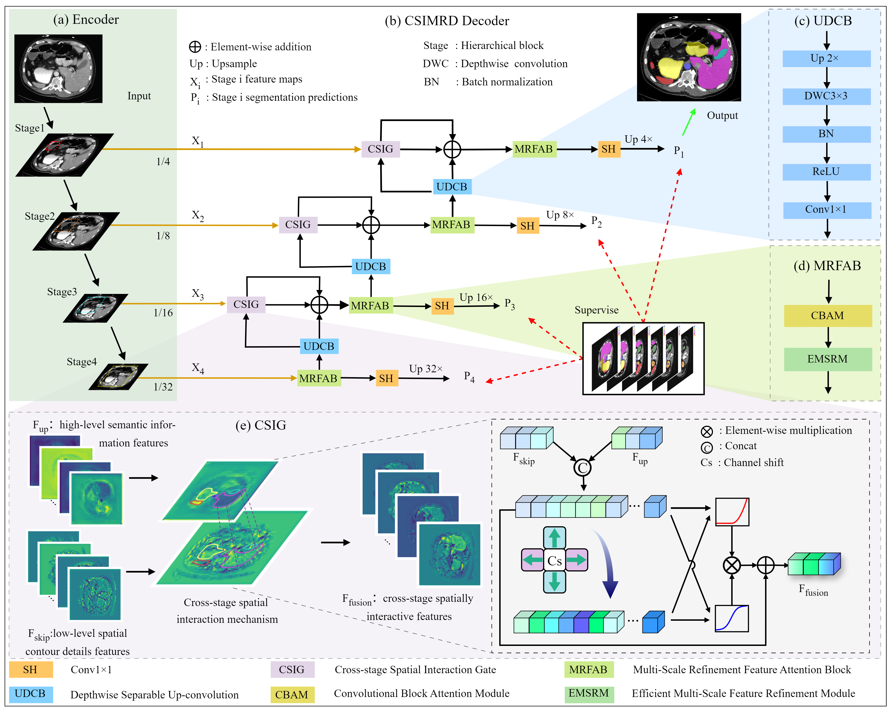
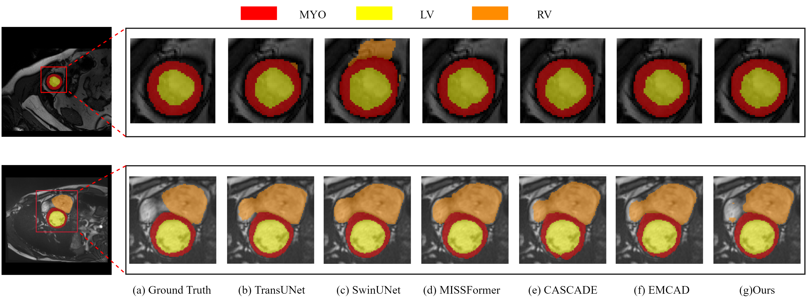

# CSIMRD

[//]: # (Official Pytorch implementation of the paper [EMCAD: Efficient Multi-scale Convolutional Attention Decoding for Medical Image Segmentation]&#40;https://cvpr.thecvf.com/virtual/2024/poster/30814&#41; published in CVPR 2024.  [arxiv]&#40;https://arxiv.org/abs/2405.06880&#41; [code]&#40;https://github.com/SLDGroup/EMCAD/&#41; [video]&#40;https://youtu.be/cFLWj6ystzw&#41;)

[//]: # (<br>)

[//]: # ([Md Mostafijur Rahman]&#40;https://github.com/mostafij-rahman&#41;, [Mustafa Munir]&#40;https://github.com/mmunir127&#41;, [Radu Marculescu]&#40;https://radum.ece.utexas.edu/&#41;)

[//]: # (<p>The University of Texas at Austin</p>)

## Architecture

<p align="center">

</p>

[//]: # (## Quantitative Results)

[//]: # (<p align="center">)

[//]: # ()

[//]: # ()

[//]: # (</p>)

## Results
####  Qualitative results of Synapse dataset:
<p align="center">

</p>

####  Qualitative results of ACDC dataset:
<p align="center">

</p>

[//]: # (<p align="center">)

[//]: # ()

[//]: # (</p>)

## Usage:
### Data preparation:

#### - **Synapse Multi-organ dataset:**

- official Synapse website:
Sign up in the [official Synapse website](https://www.synapse.org/Synapse:syn3193805/wiki/89480)  and download the dataset. Then split the 'RawData' folder into 'TrainSet' (18 scans) and 'TestSet' (12 scans) following the TransUNet's lists and put in the './data/synapse/Abdomen/RawData/' folder. Finally, preprocess using python ./utils/preprocess_synapse_data.py and save in the './data/synapse/' folder.
- TransUNet：
 If you use the preprocessed data from [TransUNet](https://drive.google.com/drive/folders/1ACJEoTp-uqfFJ73qS3eUObQh52nGuzCd), please make necessary changes (i.e., remove the code segment (line# 88-94) to convert groundtruth labels from 14 to 9 classes) in the utils/dataset_synapse.py. 

#### - **ACDC dataset:**

- Download the preprocessed ACDC dataset from [Google Drive of MT-UNet](https://drive.google.com/file/d/13qYHNIWTIBzwyFgScORL2RFd002vrPF2/view) and move into './data/ACDC/' folder.

#### - **Polyp datasets:**

- Download the training and testing datasets [Google Drive](https://drive.google.com/file/d/1pFxb9NbM8mj_rlSawTlcXG1OdVGAbRQC/view?usp=sharing) and move them into './data/polyp/' folder.

#### - **ISIC2018 dataset:**

- Download the training and validation datasets from [Download Link](https://challenge.isic-archive.com/landing/2018/) and merge them together. Afterwards, split the dataset into 80%, 10%, and 10% training, validation, and testing datasets, respectively. Move the splited dataset into './data/ISIC2018/' folder. 

#### - **BUSI dataset:**
- Download the training and validation datasets from [Google Drive](https://drive.google.com/file/d/1t3cyyTbA0mikL8L2rWRtREdWTLfmA3qL/view)and move them into './data/BUSI/' folder.


### Pretrained model:
- You can download the pretrained PVTv2 model from [Google Drive](https://drive.google.com/drive/folders/1Eu8v9vMRvt-dyCH0XSV2i77lAd62nPXV?usp=sharing)/[PVT GitHub](https://github.com/whai362/PVT/releases/tag/v2), and then put it in the './Model/pretrained_pth/' folder for initialization.

### Pretrained Checkpoint:
- If you only want to perform inference to validate the effectiveness of the model,you can download the Pretrained Checkpoint model from [Google Drive]() and put it in the './results/model_pth/' folder and then run the command in the Test section below .


### Recommended environment:
#### **Please run the following code to create the environment.**
```
conda create -name CSIMRDenv python=3.8
conda activate CSIMRDenv

pip install torch==1.11.0+cu113 torchvision==0.12.0+cu113 torchaudio==0.11.0 --extra-index-url https://download.pytorch.org/whl/cu113

pip install mmcv-full -f https://download.openmmlab.com/mmcv/dist/cu113/torch1.11.0/index.html

pip install -r requirements.txt
```
### Train:

```
cd CSIMRDenv

python -W ignore train_synapse.py --root_path data/synapse/train_npz --volume_path data/synapse/test_vol_h5 --encoder pvt_v2_b2 --snapshot_path results/model_pth/CCMIX_sfv2b_v2_[3,5,7] --kernel_sizes 3 5 7 --batch_size 6 --chunk 1  
```
- --root_path：Specifies the root path of the training dataset.    
- --volume_path：Specifies the path to the test dataset.           
- --encoder：Defines the encoder model to be used.     
- --snapshot_path:Specifies the directory where model checkpoints (snapshots) will be saved during training.     
- --kernel_sizes:Defines the sizes of convolutional kernels used in the MRSFB.       
- --batch_size:Sets the batch size
### Test:
```
python test.py --volume_path data/synapse/test_vol_h5 --test_path results/model_pth/CCMIX_sfv2b_v2_[3,5,7]/best.pth --test_save_dir results/results/CCMIX_sfv2b_v2_[3,5,7] --snapshot_name CCMIX_sfv2b_v2_[3,5,7] --kernel_sizes 3 5 7 --encoder pvt_v2_b2 --chunk 1 --is_savenii True
```
- --test_path:Specifies the path to the trained model checkpoint.     
- --test_save_dir：Specifies the directory where test results will be saved.    
- --snapshot_name：Specifies the filename for saving the inference results.   
- --is_savenii：Specifies whether to save the inference results in NIfTI (.nii) format.

## Acknowledgement
- I 'm deeply grateful for the excellent works I have referenced. 
[ShuffleNet V2](https://openaccess.thecvf.com/content_ECCV_2018/html/Ningning_Light-weight_CNN_Architecture_ECCV_2018_paper.html),[ShuffleNet](https://openaccess.thecvf.com/content_cvpr_2018/html/Zhang_ShuffleNet_An_Extremely_CVPR_2018_paper.html),[G-CASCADE](https://github.com/SLDGroup/G-CASCADE), [PVT_v1,v2](https://github.com/whai362/PVT), [GLoG-CSUnet
](https://github.com/HAAIL/GLoG-CSUnet), [Polyp-PVT](https://github.com/DengPingFan/Polyp-PVT) and [TransUNet](https://github.com/Beckschen/TransUNet)
They have provided valuable inspiration and guidance, helping me progress in my research and creative endeavors. I appreciate the hard work of the authors, which continues to inspire me to reach higher goals.
We are very grateful for these excellent works
## Citations

``` 
@inproceedings{,
  title={CSIMRD : Cross-stage Spatial Interaction and Multi-scale Refinement Decoder for Medical Image Segmentation},
  author={BoHe},
  booktitle={},
  pages={},
  year={2025}
}
```
